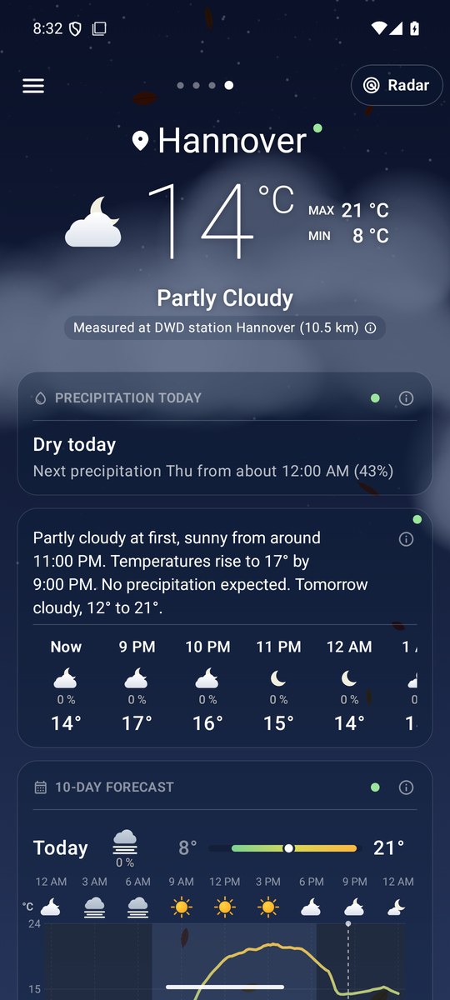
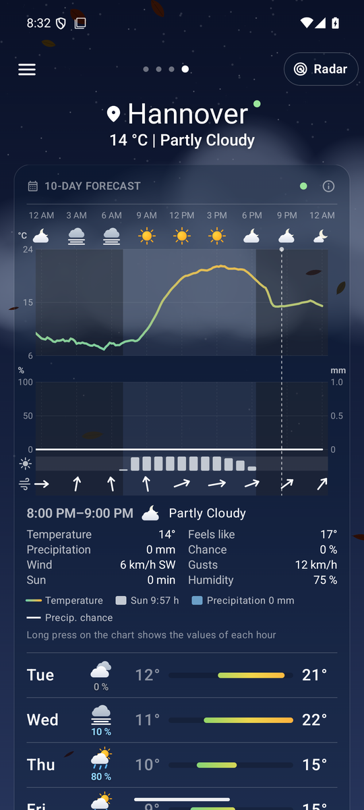
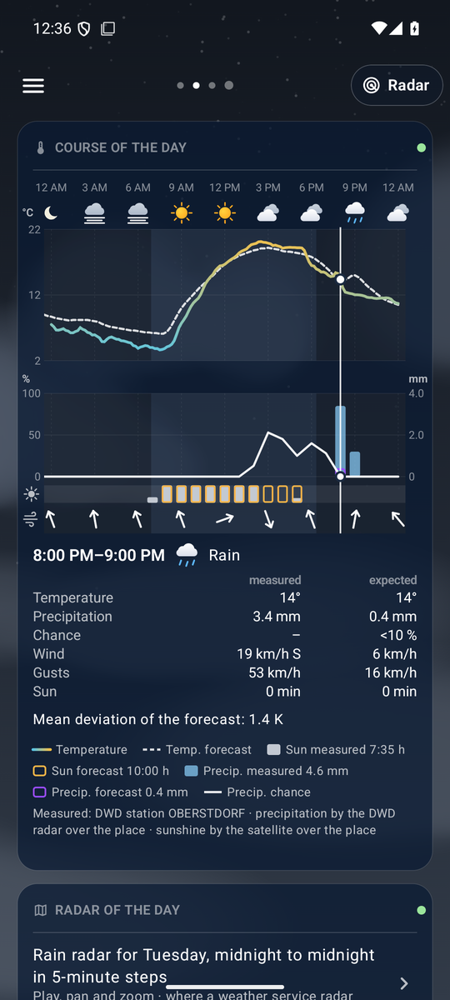
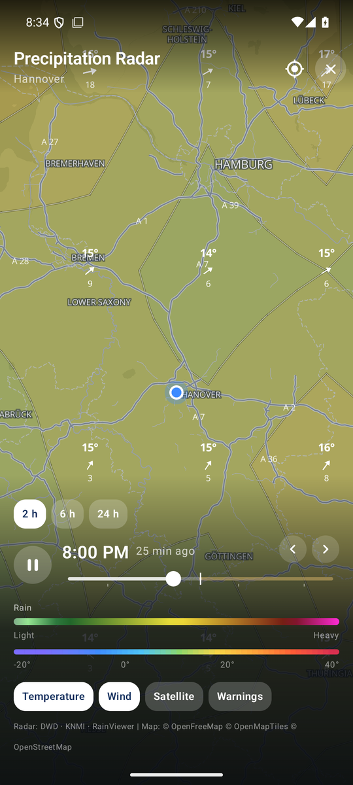
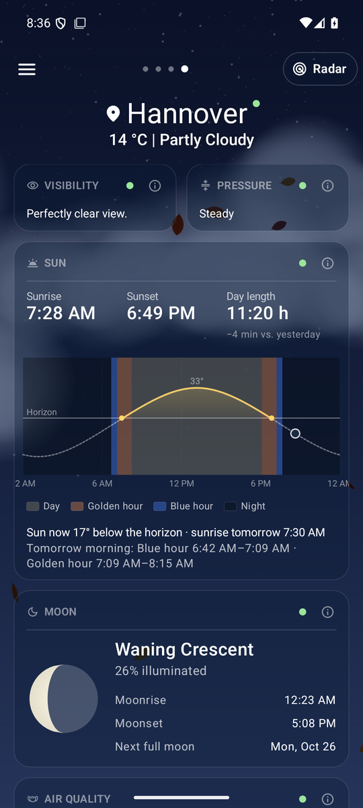

<!--
  Nimbus - README.en.md
  Overview in English: features, data sources, building and licensing.

    Copyright (C) 2026 Thorsten Schnebeck <thorsten.schnebeck@gmx.net>
    Produced by Thorsten Schnebeck - the idea, the decisions, the testing.
    Written by Anthropic Claude Opus 5.5 - AI generated content.

    Free software under the GNU General Public License, version 3 or later.
    There is no warranty, to the extent permitted by law. The full text is in
    LICENSES/GPL-3.0-or-later.txt.

  SPDX-FileCopyrightText: (C) 2026 Thorsten Schnebeck <thorsten.schnebeck@gmx.net>
  SPDX-FileContributor: Anthropic Claude Opus 5.5 (AI generated content)
  SPDX-License-Identifier: GPL-3.0-or-later
-->

<p align="right"><a href="README.md">Deutsch</a></p>

# Nimbus – weather for Germany and Europe

Nimbus reflects the current weather with small matching background animations – drifting clouds,
rain, snow or a starry sky. The data comes from Europe's weather services – readings from the
nearest weather station (DWD, GeoSphere Austria, MeteoSwiss, DMI, else an airport), the forecast of
the finest model for the place or of a model of your choice, per place too, and the rain radar of
the DWD and the KNMI. No ads, no account, no Google services. The app speaks English and German.

<p align="center">
  
  <br><sub>The sky follows the weather, the position of the sun and the season (demo mode shown).</sub>
</p>

<table>
  <tr>
    <td align="center" width="33%"><br><sub><b>Weather page</b><br>readings of the nearest weather station, outlook, hourly and 10 days</sub></td>
    <td align="center" width="33%"><br><sub><b>Meteogram</b><br>temperature, rain, sunshine and wind per hour, with a slider</sub></td>
    <td align="center" width="33%"><br><sub><b>Look back</b><br>measured versus forecast – just swipe right</sub></td>
  </tr>
  <tr>
    <td align="center"><br><sub><b>Rain radar</b><br>DWD radar with nowcast, temperature and wind layers</sub></td>
    <td align="center"><br><sub><b>Sun and moon</b><br>sun arc with golden and blue hour, moon phase</sub></td>
    <td align="center" valign="middle">
      <b>Download</b><br><br>
      <a href="https://github.com/schnebeck/nimbus-weather/releases/latest">Latest release (APK)</a><br><br>
      <sub>Android 8.0 or newer<br>no Google Play Services</sub>
    </td>
  </tr>
</table>

## Installation

The signed APKs are under [Releases](https://github.com/schnebeck/nimbus-weather/releases/latest):

| File | For |
|---|---|
| `Nimbus-<version>-arm64.apk` | practically all Android phones since about 2017 |
| `Nimbus-<version>-universal.apk` | all devices including 32-bit ARM and x86 |

Copy the APK to the phone, open it and allow installing from unknown sources. Requires Android 8.0
(API 26); Google Play Services are not needed.

## Features

- **Animated sky**: colours by the sun's position, sun, moon in its real phase, stars, clouds, fog,
  rain, snow and thunderstorms. Wind and gusts move clouds, precipitation and particles; in dry
  weather blossoms, seeds, leaves or ice crystals drift by the season, pollen by the real load.
- **Weather page**: combined symbol, temperature with unit and max/min, a short forecast for the
  next hours, DWD alerts, "Precipitation today" on top (amount, next 3 hours, highest chance; on dry
  days one line with the next precipitation, or hidden), hourly and 10-day forecast with the chance
  of precipitation, tiles for feels-like, UV, wind, humidity, visibility and pressure. The forecast
  appears at once, tiles with slower sources follow as soon as their data is there; a dot per tile
  shows whether its data is current (green) or still the previous one (yellow). Each kind of data has
  a shelf life (forecast 10, look-back 15 minutes): on returning and every minute after, the app
  loads what has expired.
  Current values come, where possible, from the nearest weather station: DWD, GeoSphere Austria,
  MeteoSwiss and DMI every 10 minutes, else an airport (METAR). Each value counts only from a station
  at the place's height (at most 300 m apart) and near the model. The sky "now" follows the measured
  sunshine as the hours follow the model's – thin veil clouds do not make a cloudy sky while the sun
  shines through; the running hour in the day chart shows the same weather as the header. The ⓘ of
  "Measured at …" names for each value whether it was measured (and where) or comes from the model.
  Networks and rules: [docs/STATIONS.en.md](docs/STATIONS.en.md).
- **Meteogram** per day (00–24 h): temperature (forecast every 15 minutes, the DWD station's readings
  every 10 minutes), precipitation, sunshine and wind per hour, night shading, a legend with the
  day's totals. The station's 10-minute readings as 30-minute means, the forecast continuing from the
  last reading without a step. Precipitation in the temperature chart or as a chart of its own below,
  with the chance as a line (in the look-back too). A long press shows a cursor with all values of
  the hour, in the columns "measured | expected". What was measured stands as a filled bar, what is
  expected as a frame – precipitation violet, sunshine orange. Today the meteogram, precipitation and
  pressure show the readings for the hours already over, the forecast after them; an hour without a
  reading stays empty, the legend says "not measured". Precipitation is measured by the DWD radar
  over the place, sunshine by the satellite – not by a station 20–40 km away
  ([docs/STATIONS.en.md](docs/STATIONS.en.md)); below the chart it says where the measurements come from.
- **Look back** by swiping right: today so far, yesterday, the day before – DWD readings against the
  forecast of the chosen model, on top the day in parts (early to night) with symbol and weather, the
  sky showing them one after the other; the mean deviation, the hourly values as a table
  measured | expected; precipitation measured and forecast with its chance; and the rain radar of the
  whole day in 5-minute steps to play, pan and zoom (where a weather service radar measures: DWD,
  KNMI, MET Norway).
- **Sun and moon**: sun arc on a fixed scale per place (the height of the arc shows the season),
  light phases day, golden hour, blue hour and night, day length; moon phase, rise and set.
- **Environment**: air quality, pollen (DWD index and composition, species to choose – e.g. trees
  only), citizen sensors, a comparison of eight weather models.
- **Tides and water levels**: the gauges within 10 km, one per water body (e.g. Weser, Fulda and
  Werra in Hann. Münden), free places with further water bodies up to 15 km. At the coast and on
  tidal rivers first the next high and low waters with a tide curve – computed from four weeks of
  gauge readings, about ±30 minutes, not for navigation or mudflat hiking. Readings from the federal
  waterways and from Lower Saxony, NRW, Saxony and Hesse, elsewhere the flood classification of the
  state portal with a link; plus the states' flood warnings. Which source per state and why:
  [docs/GAUGES.en.md](docs/GAUGES.en.md).
- **Bathing waters**: all official EU bathing sites within an adjustable radius (10–100 km) – lakes,
  rivers, coasts –, favourites at any distance; EU classification, sea temperature at the coast, in
  Berlin and Schleswig-Holstein the latest samples with water temperature and blue-green algae
  notes. Sources per state: [docs/BATHING.en.md](docs/BATHING.en.md).
- **Rain radar**: DWD radar with a 2-hour nowcast for Germany, KNMI radar for the Netherlands, MET
  Norway's radar for Norway, Sweden, Finland and Denmark (1 km, zoomed out an overview in coarser
  cells), RainViewer for the rest of Europe (every 10 minutes, the steps between computed from the
  motion; the time line follows the place's radar), one colour scale for
  rain (green → yellow → red → magenta) and snow (turquoise → white → violet, per pixel by the
  temperature), optionally calmer in blue and pink–violet; the radar cells smoothed at every zoom
  level instead of blocks; smooth playback: between two radar images the motion of the rain is
  computed; an own radar store – each image of a weather service (all of Germany, the Netherlands in
  one) is loaded once, turned into reflectivity and kept locally until it expires (analyses ~3½ days),
  panning and zooming need no network; opaque colours, roads, borders and names above the radar;
  temperature (with isotherms) and wind layers, satellite (Meteosat, every 10 minutes, at the time of
  the radar image), warning map, look-back up to 24 h. The radar of a day in the look-back shows
  temperature, wind and satellite too. For someone who opened the radar within the last week, the app
  loads the past images of the current place's 2-hour loop ahead on Wi-Fi while it is open (the radar
  forecast is fetched by the radar itself – it is new every 5 minutes). The radar resolution follows the device's memory. Without a connection the radar shows the
  stored images; nothing waits forever. The precipitation map on the weather page shows the same
  picture for its area around the place, loading only that area's radar cells, in a lane of its own
  beside the radar loop.
- **Battery**: the animated sky runs at 30 frames/s (rain, snow: 60), after a minute without touch at
  15; in the system's battery saver, with the system's animations off or the animation switched off it
  stands still – without rain, snow, lightning and leaves. Nimbus works only while it is shown: no
  update in the background, no timers behind the lock screen, and the radar stops too when the phone
  is locked. On opening the app loads what has expired – until then it shows the last data with a
  yellow dot –, the look-back for the place shown only.
- **Accessibility**: large system font up to 200 % and small displays from 320 dp – nothing overlaps
  or is cut off, long words are hyphenated or shortened; the 10-day rows go to two lines with a large
  font.
- **Full screen**: a double tap on the sky above the cards hides and shows the status and navigation
  bars, optionally by a button too; with three-button navigation the app ends above the buttons.
- **Glossary**: the ⓘ on every card explains the terms.
- **My location**: while it is shown (its page, the list of places) the position is looked for on
  opening and after 5 minutes – by cell/Wi-Fi first, by GPS as well where that gives nothing (e.g. on
  an EDGE network). A dot on the location pin tells whether the position is current (green) or older
  (yellow, then the cards too); searches without result wait longer each time (2, 5, 10 minutes). For
  saved places the GPS stays off. Reloading (or tapping the pin) asks for the position first –
  everything for "My location" is yellow and waits until it is confirmed or the new place is taken;
  then the cards turn green one by one. A reload fetches everything anew (no cache, station lists and
  tides too); if a request fails, the old data stay, yellow, and are tried again next time.
- **Shelf life**: each part of the data has its own – forecast, station, citizen sensors and flood
  alerts 10 minutes, gauges 15, air quality and bathing waters 60, pollen 3 hours. Past it, the part
  tells so itself – its dot turns yellow that very moment (no timer redrawing the page) – and only
  that part is loaded again; each card turns green as soon as its source has answered. With the
  position out of date, so are all data of "My location". Stored data nobody needs is deleted: data
  of a moment after 4 days (as far as the look-back reaches), lists (gauges, bathing waters, tides)
  after 30 days without use, the weather of removed places at once.
- **Places, settings**: my location and saved places (long press to sort and delete); the forecast
  model (preset: Automatic – the finest model for each place and time, named with its grid in the
  data sources), units (on first start to suit the country), station values, animations, order and
  visibility of the cards.
- **A model per place**: in the list of places (long press) each place first gets "As in the app
  settings" or "A model of its own for this place", then the model – regional ones too, like MET
  Nordic (1 km) or KNMI Harmonie (2 km); outside their area and after their last hours "Automatic"
  takes over. ⧉ adds a place once more, e.g. to see two models side by side. All models with grid,
  area and range: [docs/MODELS.en.md](docs/MODELS.en.md).
- **Tablet, landscape**: from 600 dp width the cards in two columns (a card that would stand alone in
  its row across the full width), phones held sideways in three equal columns: the header on the
  left, the cards in the other two (nothing under the camera cut-out); on large tablets in landscape
  a places sidebar on the left; settings, places, look-back and radar controls centred at a readable
  width. "Open-source licenses" lists the licences of Nimbus and of all libraries used. Offline the
  data loaded last.

## Data sources

| Purpose | Source |
|---|---|
| Forecast | [Open-Meteo](https://open-meteo.com): preset "best match", to choose DWD ICON, ECMWF IFS, Météo-France, MET Nordic (MET Norway), KNMI Harmonie, DMI Harmonie, UK Met Office, MeteoSwiss ICON-CH1/-CH2, GeoSphere AROME, ItaliaMeteo ICON-2I; gaps from "best match" |
| Current readings | DWD stations via [Bright Sky](https://brightsky.dev), [GeoSphere Austria](https://data.hub.geosphere.at), [MeteoSwiss](https://opendatadocs.meteoswiss.ch), [DMI](https://www.dmi.dk/friedata), airports (METAR, [aviationweather.gov](https://aviationweather.gov)) |
| Alerts, look-back | DWD alerts and stations via Bright Sky |
| Measured over the place | Precipitation: DWD radar RADOLAN (RW, RY), Germany · sunshine: DWD from EUMETSAT MTG satellite data via [Open-Meteo](https://open-meteo.com/en/docs/satellite-radiation-api), Europe |
| Radar, warning map | DWD GeoServer, [KNMI](https://english.knmidata.nl/open-data) (Netherlands), [MET Norway](https://www.met.no/en/free-meteorological-data) (Nordic composite); rest of Europe: [RainViewer](https://www.rainviewer.com/api.html) |
| Satellite | Meteosat (MTG, GeoColour) via [EUMETView](https://view.eumetsat.int) – "Contains modified EUMETSAT Meteosat data", CC BY 4.0 |
| Air quality, pollen in Europe | Copernicus CAMS via Open-Meteo |
| Pollen in Germany | [DWD pollen hazard index](https://opendata.dwd.de/climate_environment/health/alerts/s31fg.json) |
| Citizen sensors | [Sensor.Community](https://sensor.community) |
| Model comparison, temperature/wind grid | Open-Meteo |
| Water levels, tides, floods | PEGELONLINE (WSV), NLWKN, LANUK NRW, LfULG Sachsen, HLNUG, Länderübergreifendes Hochwasserportal – details in [docs/GAUGES.en.md](docs/GAUGES.en.md) |
| Bathing waters | European Environment Agency, LAGeSo Berlin, Schleswig-Holstein, sea temperature Open-Meteo – details in [docs/BATHING.en.md](docs/BATHING.en.md) |
| Name of my location | the system geocoder, else [Nominatim](https://nominatim.org) (OpenStreetMap) |
| Sun and moon | computed on the device (after SunCalc and J. Meeus) |
| Map | [OpenFreeMap](https://openfreemap.org) · © OpenMapTiles · © OpenStreetMap contributors |

The free Open-Meteo API allows 5,000 calls per hour and 10,000 per day per IP address. So the app
caches grid data for an hour and shows the data stored last when the limit is reached.

## Building

Requires JDK 21 and the Android SDK with platform 37 and build tools 36.

```bash
echo "sdk.dir=$HOME/Android/Sdk" > local.properties
./gradlew testDebugUnitTest      # unit tests, including the screenshot comparison of the charts
./gradlew assembleRelease        # APKs in app/build/outputs/apk/release/
```

The tests render the charts from fixed data (Robolectric, Roborazzi) and compare them with the
reference images in `app/src/test/screenshots/`; a test also checks in the finished image that the
cursor stands centred on its bar. After an intended change of the look,
`./gradlew recordRoborazziDebug` writes new reference images.

Signing uses `keystore/keystore.properties` (not in the repository); without it the release APK
stays unsigned (`app-universal-release-unsigned.apk`), as F-Droid expects it.

Technology: Kotlin, Jetpack Compose (Material 3), OkHttp, kotlinx.serialization, DataStore,
WorkManager, MapLibre Android, AboutLibraries (licence list, generated at build time).

### F-Droid

Store texts, screenshots and change notes are in the F-Droid format under
`fastlane/metadata/android/` (German and English). The draft build recipe for the fdroiddata
repository is in `docs/fdroid/dev.nimbus.weather.yml`.

### Demo mode for visual tests

```bash
adb shell am start -S -n dev.nimbus.weather/.MainActivity \
  --es demo_condition THUNDERSTORM --ez demo_night true \
  --es demo_season AUTUMN --es demo_wind 0.8 --es demo_pollen 0.5
```

`demo_condition`: CLEAR … THUNDERSTORM (see `Condition`) · `demo_season`: SPRING, SUMMER, AUTUMN,
WINTER · `demo_wind`: −1…1 · `demo_screen`: radar, places, settings · `demo_radar_temp`:
temperature offset for the radar colouring.

### Project structure

```
app/src/main/java/dev/nimbus/weather/
  data/model      domain model, WMO codes, settings
  data/remote     Open-Meteo, Bright Sky (DWD), station networks (GeoSphere, MeteoSwiss, DMI, METAR),
                  pollen, Sensor.Community, look-back, radar and satellite over the place
  data/repo       repository, weather now (measurement and model), location, storage,
                  shelf life of the data
  ui/background   animated sky, seasonal particles
  ui/main         weather page, cards, meteogram, look-back
  ui/radar        radar: composites of the DWD, the KNMI and MET Norway, RainViewer, radar store, preview,
                  colour scale, temperature/wind layers
  ui/places, ui/settings, ui/components, ui/theme
  util            units and formatting, sun and moon
```

## Licence

Nimbus is free software under the **GNU General Public License, version 3 or later**
(`LICENSES/GPL-3.0-or-later.txt`). There is no warranty, to the extent permitted by law.

Every file states its licence in its header or in `REUSE.toml` (checked with
[`reuse lint`](https://reuse.software)). Deviating from it:

- Sun and moon calculation in `util/Moon.kt`: partly after SunCalc, © 2026 Volodymyr Agafonkin,
  BSD-2-Clause
- Gradle wrapper: Apache-2.0
- Recorded API responses in `app/src/test/resources/fixtures/`: data of Open-Meteo (MET Norway too),
  DWD, Copernicus, GeoSphere Austria, MeteoSwiss, DMI and KNMI under CC BY 4.0, METAR (US government)
  in the public domain, Sensor.Community and Nominatim under ODbL 1.0, gauge data by their
  publishers' terms – in detail in `REUSE.toml`
- Screenshots in `docs/screenshots/`: CC BY 4.0, with weather, radar and map data of DWD, Open-Meteo,
  RainViewer, OpenFreeMap, OpenMapTiles and OpenStreetMap contributors (ODbL)

Idea, decisions and testing: Thorsten Schnebeck. Written by Anthropic Claude Opus 5.5 (AI generated
content).
