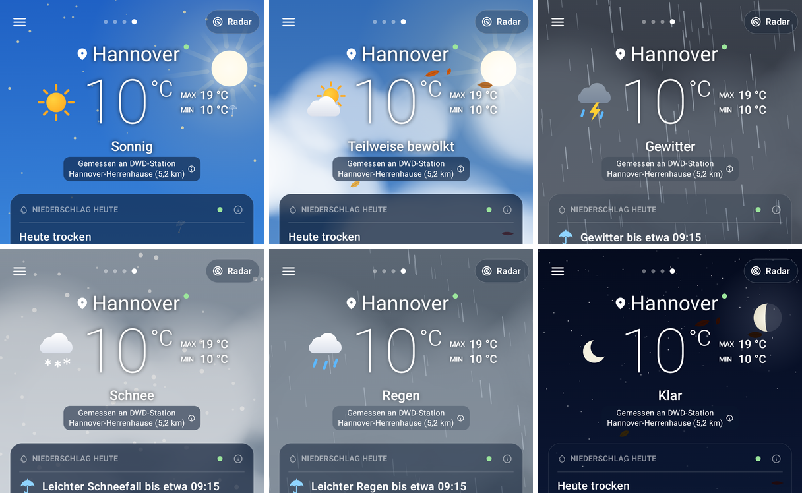
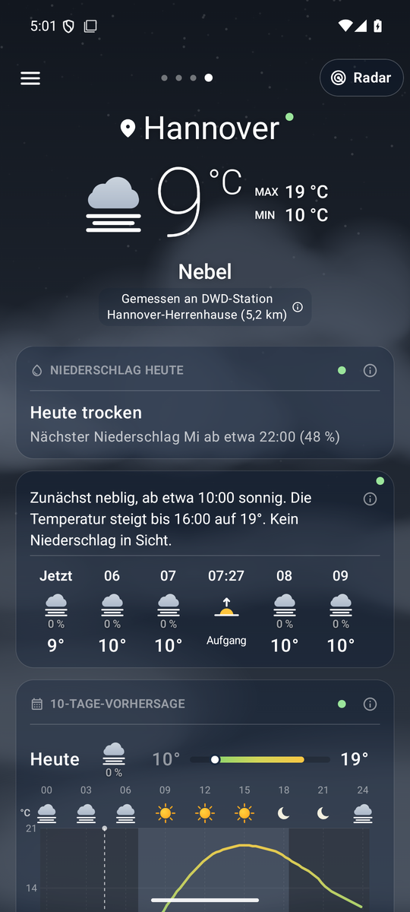
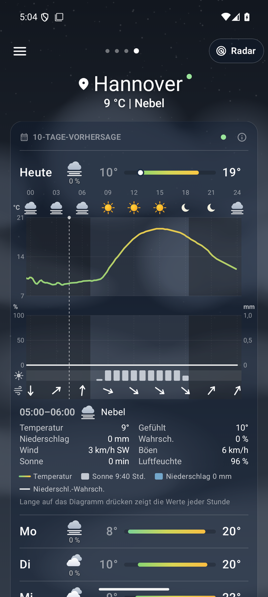
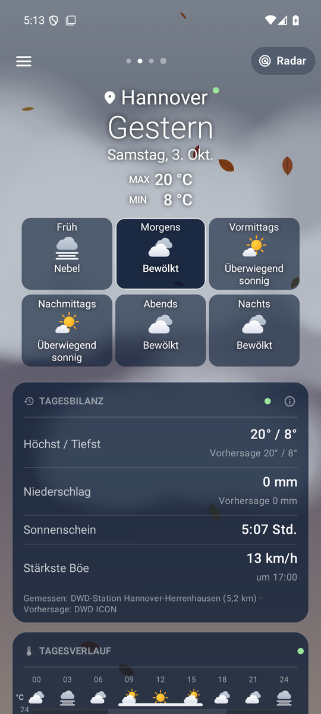
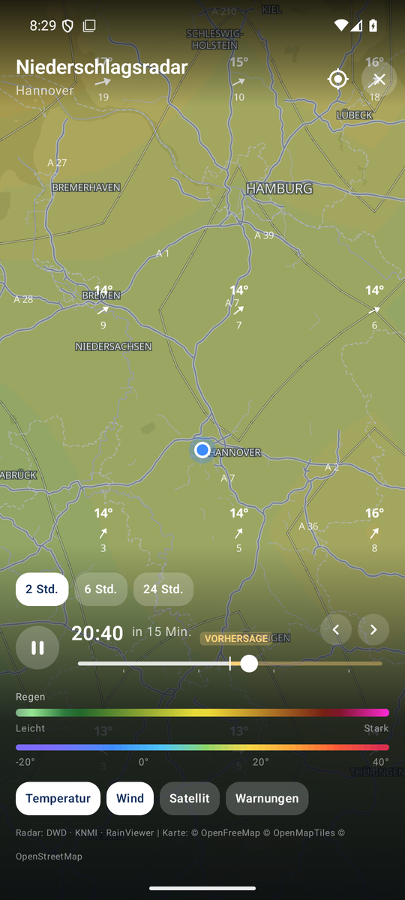
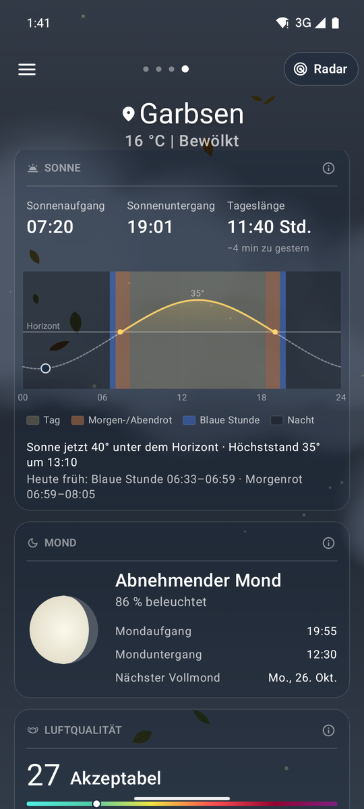

<!--
  Nimbus - README.md
  Overview: features, data sources, building and licensing.

    Copyright (C) 2026 Thorsten Schnebeck <thorsten.schnebeck@gmx.net>
    Produced by Thorsten Schnebeck - the idea, the decisions, the testing.
    Written by Anthropic Claude Opus 5.5 - AI generated content.

    Free software under the GNU General Public License, version 3 or later.
    There is no warranty, to the extent permitted by law. The full text is in
    LICENSES/GPL-3.0-or-later.txt.

  SPDX-FileCopyrightText: (C) 2026 Thorsten Schnebeck <thorsten.schnebeck@gmx.net>
  SPDX-FileContributor: Anthropic Claude Opus 5.5 (AI generated content)
  SPDX-License-Identifier: GPL-3.0-or-later
-->

<p align="right"><a href="README.en.md">English</a></p>

# Nimbus – Wetter für Deutschland und Europa

Nimbus symbolisiert das aktuelle Wetter mit passenden kleinen Hintergrundanimationen – ziehende Wolken,
Regen, Schnee oder ein Sternenhimmel. Die Daten kommen vom Deutschen Wetterdienst – Messwerte der
nächsten Wetterstation, die Vorhersage des hochauflösenden Modells ICON-D2 und das Regenradar.
Keine Werbung, kein Konto, keine Google-Dienste.

<p align="center">
  
  <br><sub>Der Himmel folgt dem Wetter, dem Sonnenstand und der Jahreszeit (hier im Demo-Modus).</sub>
</p>

<table>
  <tr>
    <td align="center" width="33%"><br><sub><b>Wetterseite</b><br>Messwerte der nächsten DWD-Station, Kurzvorhersage, Stunden und 10 Tage</sub></td>
    <td align="center" width="33%"><br><sub><b>Meteogramm</b><br>Temperatur, Regen, Sonnenschein und Wind je Stunde – mit Schieber</sub></td>
    <td align="center" width="33%"><br><sub><b>Rückblick</b><br>Was war gemessen, was war vorhergesagt? Einfach nach rechts wischen</sub></td>
  </tr>
  <tr>
    <td align="center"><br><sub><b>Regenradar</b><br>DWD-Radar mit Vorhersage, Temperatur- und Windebene</sub></td>
    <td align="center"><br><sub><b>Sonne und Mond</b><br>Sonnenbogen mit Morgenrot und Blauer Stunde, Mondphase</sub></td>
    <td align="center" valign="middle">
      <b>Herunterladen</b><br><br>
      <a href="https://github.com/schnebeck/nimbus-weather/releases/latest">Neueste Version (APK)</a><br><br>
      <sub>Android 8.0 oder neuer<br>ohne Google Play Services</sub>
    </td>
  </tr>
</table>

## Installation

Die signierten APKs gibt es unter [Releases](https://github.com/schnebeck/nimbus-weather/releases/latest):

| Datei | Für |
|---|---|
| `Nimbus-<Version>-arm64.apk` | praktisch alle Android-Handys seit ca. 2017 |
| `Nimbus-<Version>-universal.apk` | alle Geräte inkl. 32-Bit-ARM und x86 |

APK aufs Handy kopieren, öffnen und die Installation aus unbekannten Quellen erlauben.
Voraussetzung: Android 8.0 (API 26). Google Play Services werden nicht benötigt.

## Funktionen

- **Animierter Himmel**: Farbverlauf nach Sonnenstand, Sonne, Mond in der echten Phase, Sterne, Wolken,
  Nebel, Regen, Schnee und Gewitter. Wind und Böen bewegen Wolken, Niederschlag und Partikel; bei
  trockenem Wetter treiben je nach Jahreszeit Blüten, Samen, Blätter oder Eiskristalle, Pollen nach
  der echten Belastung.
- **Wetterseite**: Kombisymbol, Temperatur mit Einheit und Max/Min, Kurzvorhersage für die nächsten
  Stunden, DWD-Warnungen, Niederschlag der nächsten 3 Stunden, Stunden- und 10-Tage-Vorhersage mit
  Niederschlagswahrscheinlichkeit, Kacheln für Gefühlt, UV, Wind, Luftfeuchte, Sichtweite und Luftdruck.
  Aktuelle Werte stammen, wo möglich, von der nächsten DWD-Station.
- **Meteogramm** je Tag (00–24 Uhr): Temperatur, Niederschlag, Sonnenscheindauer und Wind pro Stunde,
  Nachtschattierung, Legende mit Tagessummen. Langes Drücken blendet einen Cursor mit allen Werten
  der Stunde ein.
- **Rückblick** per Wischen nach rechts: heute bisher, gestern, vorgestern – DWD-Messwerte im
  Vergleich zur Vorhersage des gewählten Modells, mit mittlerer Abweichung; dazu das Regenradar
  des ganzen Tages in 5-Minuten-Schritten zum Abspielen, Verschieben und Zoomen (Deutschland).
- **Sonne und Mond**: Sonnenbogen mit fester Skala je Ort (die Bogenhöhe zeigt die Jahreszeit),
  Lichtphasen Tag, Morgen-/Abendrot, Blaue Stunde und Nacht, Tageslänge; Mondphase, Auf- und Untergang.
- **Umwelt**: Luftqualität, Pollenflug (DWD-Index und Zusammensetzung, Arten wählbar – z. B. nur
  Bäume), Bürger-Messnetz, Vergleich von acht Wettermodellen.
- **Gezeiten und Pegel**: Die Pegel im Umkreis von 10 km, je Gewässer einer (z. B. Weser, Fulda
  und Werra in Hann. Münden), freie Plätze mit weiteren Gewässern bis 15 km. An der Küste und an Tideflüssen zuerst die nächsten Hoch- und
  Niedrigwasser mit Tidekurve – selbst berechnet aus vier Wochen Pegelmessungen, etwa ±30 Minuten
  genau, nicht für Navigation oder Wattwanderungen. Messwerte von den Bundeswasserstraßen und aus
  Niedersachsen, NRW, Sachsen und Hessen, sonst die Hochwasser-Einstufung des Länderportals mit
  Link; dazu die Hochwasserwarnungen der Länder. Welche Quelle je Bundesland genutzt wird und
  warum: [docs/GAUGES.md](docs/GAUGES.md).
- **Badegewässer**: alle amtlichen EU-Badestellen im einstellbaren Umkreis (10–100 km) – Seen,
  Flüsse, Küsten –, Favoriten in jeder Entfernung; EU-Einstufung, Meerestemperatur an der Küste,
  in Berlin und Schleswig-Holstein die letzten Proben mit Wassertemperatur und Blaualgen-Hinweisen.
  Quellen je Bundesland: [docs/BATHING.md](docs/BATHING.md).
- **Regenradar**: DWD-Radar mit 2-h-Vorhersage für Deutschland, RainViewer für Europa, einheitliche
  Farbskala für Regen (grün → gelb → rot → magenta) und Schnee (türkis → weiß → violett, pro Pixel
  nach der Temperatur), wahlweise ruhiger in Blau bzw. Rosa–Violett; deckende Farben, Straßen,
  Grenzen und Namen über dem Radar; Temperatur- (mit Isothermen) und Windebene, Satellit, Warnkarte, Rückblick bis 24 h. Im WLAN hält die App die
  2-Stunden-Schleife des aktuellen Orts etwa alle 15 Minuten aktuell, auch im Hintergrund. Ohne
  Verbindung zeigt das Radar die gespeicherten Bilder; nichts wartet endlos.
- **Akku**: Der animierte Himmel läuft mit 30 Bildern/s (Regen, Schnee: 60), nach einer Minute ohne
  Berührung mit 15; im Energiesparmodus des Systems steht er still.
- **Lexikon**: ⓘ an jeder Karte erklärt die Begriffe.
- **Orte, Einstellungen**: Standort und gespeicherte Orte (lange drücken zum Sortieren und Löschen);
  Vorhersagemodell, Einheiten (beim ersten Start passend zum Land), Stationswerte, Animationen,
  Reihenfolge und Sichtbarkeit der Kacheln.
- **Tablet**: ab 600 dp Breite die Kacheln in zwei Spalten, im Querformat großer Tablets links eine
  Ortsleiste; Einstellungen, Orte, Rückblick und Radar-Bedienung mittig in lesbarer Breite. Unter „Open-Source-Lizenzen“ stehen die Lizenzen
  von Nimbus und aller verwendeten Bibliotheken. Stündliche Aktualisierung im Hintergrund,
  offline die zuletzt geladenen Daten.

## Datenquellen

| Zweck | Quelle |
|---|---|
| Vorhersage | DWD ICON-D2/-EU/global via [Open-Meteo](https://open-meteo.com), Lücken aus Open-Meteo „best match“ |
| Aktuelle Messwerte, Warnungen, Rückblick | DWD-Stationen und -Warnungen via [Bright Sky](https://brightsky.dev) |
| Radar, Satellit, Warnkarte | DWD GeoServer; Europa: [RainViewer](https://www.rainviewer.com/api.html) |
| Luftqualität, Pollen Europa | Copernicus CAMS via Open-Meteo |
| Pollenflug Deutschland | [DWD-Pollenflug-Gefahrenindex](https://opendata.dwd.de/climate_environment/health/alerts/s31fg.json) |
| Bürger-Messnetz | [Sensor.Community](https://sensor.community) |
| Modellvergleich, Temperatur-/Windgitter | Open-Meteo |
| Pegel, Gezeiten, Hochwasser | PEGELONLINE (WSV), NLWKN, LANUK NRW, LfULG Sachsen, HLNUG, Länderübergreifendes Hochwasserportal – Details in [docs/GAUGES.md](docs/GAUGES.md) |
| Badegewässer | Europäische Umweltagentur, LAGeSo Berlin, Schleswig-Holstein, Meerestemperatur Open-Meteo – Details in [docs/BATHING.md](docs/BATHING.md) |
| Ortsname des Standorts | System-Geocoder, sonst [Nominatim](https://nominatim.org) (OpenStreetMap) |
| Sonne und Mond | auf dem Gerät berechnet (nach SunCalc und J. Meeus) |
| Karte | [OpenFreeMap](https://openfreemap.org) · © OpenMapTiles · © OpenStreetMap-Mitwirkende |

Die freie Open-Meteo-API erlaubt 5.000 Aufrufe pro Stunde und 10.000 pro Tag je IP-Adresse. Die App
cacht deshalb Gitterdaten eine Stunde und zeigt bei Überschreitung die zuletzt gespeicherten Daten.

## Bauen

Voraussetzungen: JDK 21, Android SDK mit Plattform 37 und Build-Tools 36.

```bash
echo "sdk.dir=$HOME/Android/Sdk" > local.properties
./gradlew testDebugUnitTest      # Unit-Tests
./gradlew assembleRelease        # APKs in app/build/outputs/apk/release/
```

Signiert wird mit `keystore/keystore.properties` (nicht im Repository); fehlt die Datei, bleibt die
Release-APK unsigniert (`app-universal-release-unsigned.apk`), so wie F-Droid sie erwartet.

Technik: Kotlin, Jetpack Compose (Material 3), OkHttp, kotlinx.serialization, DataStore, WorkManager,
MapLibre Android, AboutLibraries (Lizenzliste, beim Bauen erzeugt).

### F-Droid

Store-Texte, Bildschirmfotos und Änderungshinweise liegen im F-Droid-Format unter
`fastlane/metadata/android/` (Deutsch und Englisch). Der Entwurf des Build-Rezepts für das
fdroiddata-Repository steht in `docs/fdroid/dev.nimbus.weather.yml`.

### Demo-Modus für visuelle Tests

```bash
adb shell am start -S -n dev.nimbus.weather/.MainActivity \
  --es demo_condition THUNDERSTORM --ez demo_night true \
  --es demo_season AUTUMN --es demo_wind 0.8 --es demo_pollen 0.5
```

`demo_condition`: CLEAR … THUNDERSTORM (siehe `Condition`) · `demo_season`: SPRING, SUMMER, AUTUMN,
WINTER · `demo_wind`: −1…1 · `demo_screen`: radar, places, settings · `demo_radar_temp`:
Temperatur-Verschiebung für die Radarfärbung.

### Projektstruktur

```
app/src/main/java/dev/nimbus/weather/
  data/model      Domänenmodell, WMO-Codes, Einstellungen
  data/remote     Open-Meteo, Bright Sky (DWD), Pollen, Sensor.Community, Rückblick
  data/repo       Repository, Standort, Speicher, Hintergrund-Aktualisierung
  ui/background   Animierter Himmel, Jahreszeiten-Partikel
  ui/main         Wetterseite, Karten, Meteogramm, Rückblick
  ui/radar        Radar, Farbskala, Temperatur-/Windebene
  ui/places, ui/settings, ui/components, ui/theme
  util            Einheiten und Formatierung, Sonne und Mond
```

## Lizenz

Nimbus ist freie Software unter der **GNU General Public License, Version 3 oder später**
(`LICENSES/GPL-3.0-or-later.txt`). Es gibt keine Gewährleistung, soweit gesetzlich zulässig.

Jede Datei trägt ihren Lizenzhinweis im Kopf oder in `REUSE.toml` (geprüft mit
[`reuse lint`](https://reuse.software)). Abweichend davon:

- Sonnen- und Mondberechnung in `util/Moon.kt`: teilweise nach SunCalc, © 2026 Volodymyr Agafonkin,
  BSD-2-Clause
- Gradle-Wrapper: Apache-2.0
- Aufgezeichnete API-Antworten in `app/src/test/resources/fixtures/`: Daten von Open-Meteo, DWD und
  Copernicus unter CC BY 4.0, von Sensor.Community unter ODbL 1.0
- Screenshots in `docs/screenshots/`: CC BY 4.0, mit Wetter-, Radar- und Kartendaten von DWD,
  Open-Meteo, RainViewer, OpenFreeMap, OpenMapTiles und OpenStreetMap-Mitwirkenden (ODbL)

Idee, Entscheidungen und Tests: Thorsten Schnebeck. Geschrieben von Anthropic Claude Opus 5.5
(KI-generierter Inhalt).
