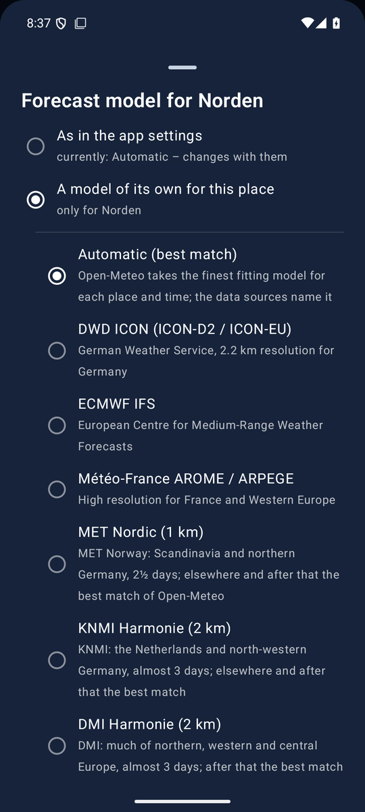

<!--
  Nimbus - docs/MODELS.en.md
  Forecast models: the preset, the models to choose, regional models and a model per place.

    Copyright (C) 2026 Thorsten Schnebeck <thorsten.schnebeck@gmx.net>
    Produced by Thorsten Schnebeck - the idea, the decisions, the testing.
    Written by Anthropic Claude Opus 5.5 - AI generated content.

    Free software under the GNU General Public License, version 3 or later.
    There is no warranty, to the extent permitted by law. The full text is in
    LICENSES/GPL-3.0-or-later.txt.

  SPDX-FileCopyrightText: (C) 2026 Thorsten Schnebeck <thorsten.schnebeck@gmx.net>
  SPDX-FileContributor: Anthropic Claude Opus 5.5 (AI generated content)
  SPDX-License-Identifier: GPL-3.0-or-later
-->

<a href="MODELS.md">Deutsch</a>

# Forecast models

As of **5 October 2026** (Nimbus 1.34.1). All models come via [Open-Meteo](https://open-meteo.com).

## Automatic (the preset)

"Automatic" is Open-Meteo's *best match*: for each place and time the finest model that fits. In
Norden (East Frisia), for example, that is KNMI Harmonie with 2 km first, ECMWF IFS with 9 km a few
days later; in Cuxhaven DWD ICON-D2 with 2 km. The data sources name the model at work with its
grid – Nimbus finds it by comparing the values of *best match* with those of the single models.

## Models to choose

| Model | Grid | Area | Range |
|---|---|---|---|
| DWD ICON (ICON-D2 / ICON-EU) | 2 km (D2), 7 km (EU), 13 km (global), finest first | Germany, Europe, worldwide | 10 days |
| ECMWF IFS | 0.25° (about 25 km) | worldwide | 10 days |
| Météo-France AROME / ARPEGE | 1.5–2.5 km (AROME), 11 km (ARPEGE), finest first | France, Western Europe, worldwide | 10 days |
| MET Nordic | 1 km | Scandinavia, northern Germany | 2½ days |
| KNMI Harmonie | 2 km | the Netherlands, north-western Germany | almost 3 days |
| DMI Harmonie | 2 km | much of northern, western and central Europe | almost 3 days |
| UK Met Office | 2 km | the British Isles and around them | about 2½ days |
| MeteoSwiss ICON-CH1 | 1 km | Switzerland, the Alps | 1½ days |
| MeteoSwiss ICON-CH2 | 2 km | Switzerland, the Alps | 5 days |
| GeoSphere AROME | 2.5 km | Austria, the Alps | almost 3 days |
| ItaliaMeteo ICON-2I | 2.2 km | Italy, the Alps | 3 days |

**Regional models** compute only for their area and only a few days. Outside their area "Automatic"
takes over completely; after their last hours it fills up the 10 days. The data sources say from
when on and with which model. On the day of the change the highest and lowest values match the hours
shown: the chosen model's up to the change, "Automatic"'s after it. What a model does not give (such
as the chance of precipitation) comes from "Automatic" as well.

## A model per place

In the list of places (long press, then tap "Model: …") each place first gets one of:

- **As in the app settings** – the place follows the setting and changes with it; the list then says,
  for example, "Model: Automatic (app setting)".
- **A model of its own for this place** – the list of models unfolds beneath it, the model in force
  marked. Only tapping a model fixes it for the place.

"My location" moves and always takes the model of the settings.

**The same place more than once:** ⧉ in the edit mode adds a place once more and opens its model
choice right away – e.g. to see MET Nordic and KNMI Harmonie for the same place side by side. Its
pages then carry the model under the name. A copy left without a model choice is discarded again.

## Look-back and model comparison

The look-back compares the measurements with the forecast of the model in force for the place;
outside a regional model's area with "Automatic". The "Model Comparison" card shows, independently,
the temperature of the next 72 hours from eight models: ICON-D2, ICON-EU, ECMWF IFS, ARPEGE/AROME,
UK Met Office, KNMI Harmonie, MET Norway and NOAA GFS.
