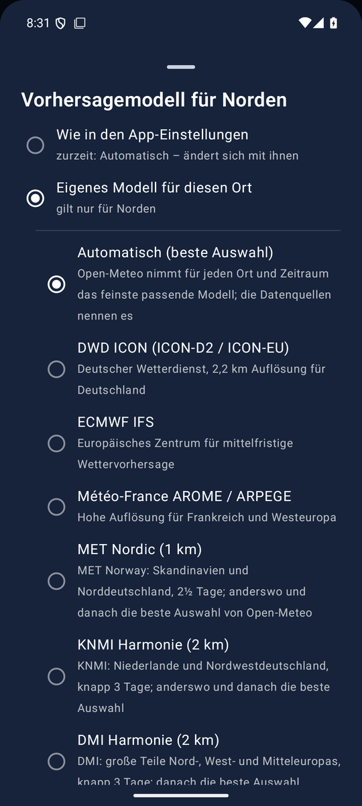

<!--
  Nimbus - docs/MODELS.md
  Forecast models: the preset, the models to choose, regional models and a model per place.

    Copyright (C) 2026 Thorsten Schnebeck <thorsten.schnebeck@gmx.net>
    Produced by Thorsten Schnebeck - the idea, the decisions, the testing.
    Written by Anthropic Claude Opus 5.5 - AI generated content.

    Free software under the GNU General Public License, version 3 or later.
    There is no warranty, to the extent permitted by law. The full text is in
    LICENSES/GPL-3.0-or-later.txt.

  SPDX-FileCopyrightText: (C) 2026 Thorsten Schnebeck <thorsten.schnebeck@gmx.net>
  SPDX-FileContributor: Anthropic Claude Opus 5.5 (AI generated content)
  SPDX-License-Identifier: GPL-3.0-or-later
-->

<a href="MODELS.en.md">English</a>

# Vorhersagemodelle

Stand: **5. Oktober 2026** (Nimbus 1.34.1). Alle Modelle kommen über [Open-Meteo](https://open-meteo.com).

## Automatisch (voreingestellt)

„Automatisch“ ist Open-Meteos *best match*: für jeden Ort und Zeitraum das feinste passende Modell.
In Norden (Ostfriesland) ist das zum Beispiel erst KNMI Harmonie mit 2 km, ein paar Tage später
ECMWF IFS mit 9 km; in Cuxhaven DWD ICON-D2 mit 2 km. Welches gerade rechnet, steht in den
Datenquellen mit seiner Auflösung – Nimbus erkennt es, indem es die Werte von *best match* mit
denen der einzelnen Modelle vergleicht.

## Wählbare Modelle

| Modell | Gitter | Gebiet | Reichweite |
|---|---|---|---|
| DWD ICON (ICON-D2 / ICON-EU) | 2 km (D2), 7 km (EU), 13 km (global), fein zuerst | Deutschland, Europa, weltweit | 10 Tage |
| ECMWF IFS | 0,25° (etwa 25 km) | weltweit | 10 Tage |
| Météo-France AROME / ARPEGE | 1,5–2,5 km (AROME), 11 km (ARPEGE), fein zuerst | Frankreich, Westeuropa, weltweit | 10 Tage |
| MET Nordic | 1 km | Skandinavien, Norddeutschland | 2½ Tage |
| KNMI Harmonie | 2 km | Niederlande, Nordwestdeutschland | knapp 3 Tage |
| DMI Harmonie | 2 km | große Teile Nord-, West- und Mitteleuropas | knapp 3 Tage |
| UK Met Office | 2 km | Britische Inseln und Umgebung | etwa 2½ Tage |
| MeteoSwiss ICON-CH1 | 1 km | Schweiz, Alpenraum | 1½ Tage |
| MeteoSwiss ICON-CH2 | 2 km | Schweiz, Alpenraum | 5 Tage |
| GeoSphere AROME | 2,5 km | Österreich, Alpenraum | knapp 3 Tage |
| ItaliaMeteo ICON-2I | 2,2 km | Italien, Alpenraum | 3 Tage |

**Regionale Modelle** rechnen nur in ihrem Gebiet und nur wenige Tage. Außerhalb ihres Gebiets
übernimmt „Automatisch“ ganz; nach ihren letzten Stunden füllt es die 10 Tage auf. Die Datenquellen
nennen, ab wann und mit welchem Modell. Am Tag des Wechsels passen Höchst- und Tiefstwert zu den
gezeigten Stunden: bis zum Wechsel die des gewählten Modells, danach die von „Automatisch“. Was ein
Modell nicht liefert (etwa die Niederschlagswahrscheinlichkeit), kommt ebenfalls aus „Automatisch“.

## Modell je Ort

In der Ortsliste (lange drücken, dann auf „Modell: …“ tippen) wählt man für jeden Ort zuerst:

- **Wie in den App-Einstellungen** – der Ort folgt der Einstellung und wechselt mit ihr; in der
  Liste steht dann zum Beispiel „Modell: Automatisch (App-Einstellung)“.
- **Eigenes Modell für diesen Ort** – darunter klappt die Liste der Modelle auf; vorgewählt ist das
  Modell, das gerade gilt. Erst der Tipp auf ein Modell legt den Ort fest.

„Mein Standort“ wandert und nimmt immer das Modell aus den Einstellungen.

**Derselbe Ort mehrfach:** ⧉ im Bearbeiten-Modus legt einen Ort ein weiteres Mal an und öffnet
gleich dessen Modellwahl – etwa um MET Nordic und KNMI Harmonie für denselben Ort nebeneinander zu
sehen. Die Seiten tragen dann das Modell unter dem Namen. Wird für die Kopie kein Modell gewählt,
verwirft die App sie wieder.

## Rückblick und Modellvergleich

Der Rückblick vergleicht die Messungen mit der Vorhersage des Modells, das für den Ort gilt;
außerhalb des Gebiets eines regionalen Modells mit „Automatisch“. Die Karte „Modellvergleich“ zeigt
unabhängig davon die Temperatur der nächsten 72 Stunden aus acht Modellen: ICON-D2, ICON-EU,
ECMWF IFS, ARPEGE/AROME, UK Met Office, KNMI Harmonie, MET Norway und NOAA GFS.
