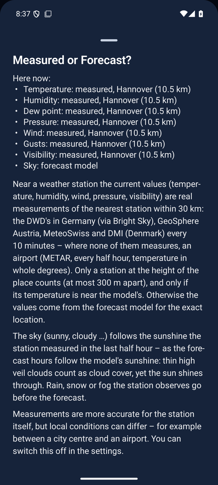

<!--
  Nimbus - docs/STATIONS.en.md
  Measured values now: which station networks Nimbus uses, which station stands for a place, and why.

    Copyright (C) 2026 Thorsten Schnebeck <thorsten.schnebeck@gmx.net>
    Produced by Thorsten Schnebeck - the idea, the decisions, the testing.
    Written by Anthropic Claude Opus 5.5 - AI generated content.

    Free software under the GNU General Public License, version 3 or later.
    There is no warranty, to the extent permitted by law. The full text is in
    LICENSES/GPL-3.0-or-later.txt.

  SPDX-FileCopyrightText: (C) 2026 Thorsten Schnebeck <thorsten.schnebeck@gmx.net>
  SPDX-FileContributor: Anthropic Claude Opus 5.5 (AI generated content)
  SPDX-License-Identifier: GPL-3.0-or-later
-->

<a href="STATIONS.md">Deutsch</a>

# Measured values – station networks

As of **5 October 2026** (Nimbus 1.34.1).

With the setting "Current values: measured, not modelled" (on by default) the top of the
weather page shows the values of the nearest weather station instead of the model's for the place.
The note "Measured at DWD station Norderney (13.5 km)" names the station of the temperature; its ⓘ
lists for each value whether it was measured (and at which station) or comes from the model.

## Networks

| Area | Network | Interval | Values | Licence |
|---|---|---|---|---|
| Germany | DWD via [Bright Sky](https://brightsky.dev) | 10 minutes | temperature, dew point, humidity, pressure, wind, gusts, visibility, cloud cover, precipitation, weather (rain, snow, fog, thunder), sunshine | CC BY 4.0 (DWD) |
| Austria | [GeoSphere Austria](https://data.hub.geosphere.at), TAWES | 10 minutes | temperature, dew point, humidity, pressure, wind, gusts, precipitation | CC BY 4.0 |
| Switzerland | [MeteoSwiss](https://opendatadocs.meteoswiss.ch), SwissMetNet | 10 minutes | temperature, dew point, humidity, pressure, wind, gusts | CC BY 4.0 |
| Denmark | [DMI](https://www.dmi.dk/friedata), metObs | 10 minutes | temperature, dew point, humidity, pressure, wind, gusts, visibility, cloud cover, precipitation | CC BY 4.0 |
| worldwide | airports (METAR) via [aviationweather.gov](https://aviationweather.gov) | 30 minutes, temperature in whole degrees | temperature, dew point, pressure, wind, gusts, visibility (up to 10 km), cloud cover, weather | public domain (US government) |

None of them needs an account or a key. The station lists of GeoSphere and MeteoSwiss are kept for
a week, "reload" fetches them anew; of the DMI's the app asks only for the stations around the
place.

## Which station stands for the place

1. **Near:** at most 30 km away, the reading at most two hours old.
2. **Network before airport:** a national 10-minute network goes first; an airport only where none
   measures. Among them, the nearest station.
3. **At the place's height:** each value counts only from a station at most 300 m higher or lower
   than the place – 300 m make about 2 K and decide between rain and snow, fog and sun. The valley
   station does not measure the summit, nor the summit station the valley. Only the pressure reduced
   to sea level holds at any height.
4. **Near the model:** a measured temperature more than 10 K off the model's belongs to another
   place; the station gives nothing then.
5. **Each value with its own station:** Bright Sky fills values the main station does not report
   right now from other stations. Each such value is held to 3. and 4. with its own station; if it
   fails, the app first takes the main station's own latest hourly value.

## The sky "now"

The models' cloud cover counts thin high veil clouds too, through which the sun shines. So the sky
follows the same rule as the forecast hours:

- If the station observes rain, snow, fog or thunder, that holds.
- Otherwise the **measured sunshine** of the last half hour (else the last hour) brightens the sky:
  from 45 minutes per hour sunny, from 15 minutes partly cloudy. Little sun measured leaves the sky
  as it is.
- Where the station measures no sunshine, the model's sunshine in the running hour counts.
- At night there is no sunshine to measure; the sky stays the model's.

The running hour in the day chart shows the same weather as the header.

## Measured over the place: radar and satellite

A station often lies 20–40 km away – a shower in between slips through. For precipitation and
sunshine of the day charts (today and the look-back) Nimbus therefore measures over the place
itself:

| Quantity | Source | Area | Delay |
|---|---|---|---|
| Precipitation | DWD radar RADOLAN RW (hourly sum, adjusted to the rain gauges, 1 km) | Germany | about 30 min |
| Precipitation, the newest hour | DWD radar RADOLAN RY (5-minute sums) | Germany | a few minutes |
| Sunshine | DWD from EUMETSAT MTG satellite data, via Open-Meteo (2.5 km) | Europe | about 20 min |

Temperature and wind still come from the station. Below the chart it says where the measurements
come from. An hour without a measurement shows no bar; the forecast stands in the value table's
"expected" column.

### Sunshine from the direct irradiance

The sunshine duration Open-Meteo derives from the satellite data counts an hour with passing
showers as fully sunny once the hour's mean direct irradiance is high enough. Nimbus therefore
works it out itself: the sun shone for the share of the hour that the satellite's mean direct
irradiance is of a clear sky's (Meinel's model by the sun's height, times 0.7). With the sun low –
below 120 W/m² of clear direct irradiance, the WMO's limit for sunshine – Open-Meteo's value stands.

Checked against 18 DWD stations measuring sunshine, from Arkona to the Zugspitze, from 20 February
(the start of the archive) to 9 October 2026, the satellite right at each station – 59,000 hours with the sun above the horizon.
The factor 0.7 was fitted on 9 stations; the figures are those of the other 9:

| | Open-Meteo | Nimbus |
|---|---|---|
| mean error of an hour | 11.8 min | 8.7 min |
| systematically too much | +6.4 min/h | +0.8 min/h |
| mean error of a day | 87 min | 61 min |

Every one of the 18 stations and every season gets better (all stations, spring: error of the day 103 → 65 min,
summer 81 → 57, autumn 60 → 48). There are no data for the winter yet. The script of the check:
[tools/sunshine_calibration.py](../tools/sunshine_calibration.py).

## Checked, not built in

| Network | Finding |
|---|---|
| KNMI (Netherlands) | station data only through the Open Data API with a personal key |
| MET Norway (Frost) | only with a registered client ID |
| Météo-France | only with a personal API key |

For these, every user would have to apply for a key of their own, which the app would keep
encrypted on the device. That is still open; until then the Netherlands, Norway and France get the
airports' values.
